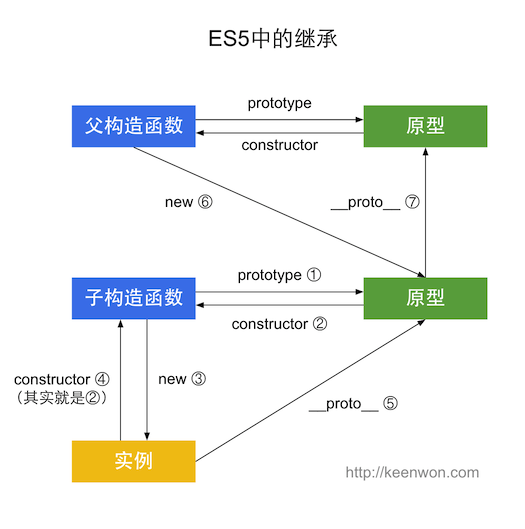

这篇文章主要是打个补丁

对于js的继承，平时写的真的少，而且基本没有写过多少复杂的继承类型，加上js继承的复杂性，所以在这里记录一下

ok，看这篇短文的两个重要的目的——ES5和ES6中的继承

## ES5 的继承



```
function Super() {}
 
function Sub() {}
Sub.prototype = new Super();
Sub.prototype.constructor = Sub;
 
var sub = new Sub();
 
Sub.prototype.constructor === Sub; //  true
sub.constructor === Sub; //  true
sub.__proto__ === Sub.prototype; //  true
Sub.prototype.__proto__ == Super.prototype; //  true
```

## ES6 继承


```
class Super {}
 
class Sub extends Super {}
 
var sub = new Sub();
 
Sub.prototype.constructor === Sub; //  true
sub.constructor === Sub; //  true
sub.__proto__ === Sub.prototype; //  true
Sub.__proto__ === Super; //  true
Sub.prototype.__proto__ === Super.prototype; // true
```

没有什么特别好解释的，看图学code


by 作者KeenWon [原文链接](http://keenwon.com/1524.html)
