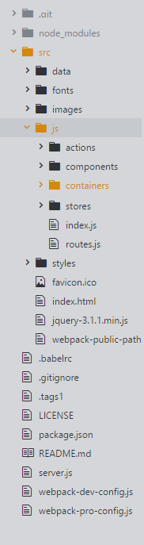
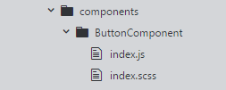
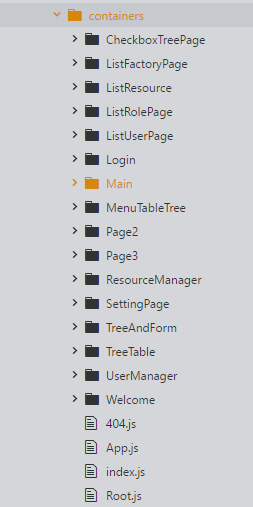
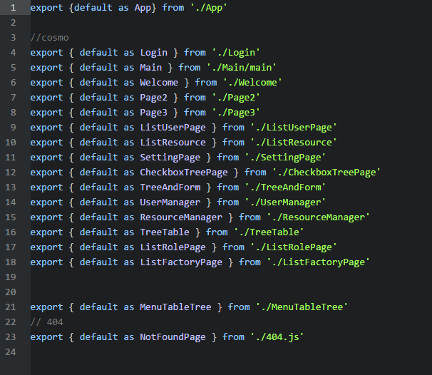

react，去年开始在人们耳朵里越来越响亮，如今，小白终于在项目中初涉react了

不多说，一起来high

## react项目目录框架



 其中：
* data是放置静态数据的
* fonts是字体
* js是放页面，组件和路由（还有reflux的action和store）

  
  
  在js目录下的component是放组件,该组件目录下包括一个index.js和一个index.scss

  * index.js是写关于组件的结构代码（react也推荐写内联样式，在这里我也写了外部代码）

  * index.scss就是sass语法写的css代码了，这样写的快点或者说舒服点

* 而container放置页面的，结构也和component一样（这里就不截图了）

* 每个目录下都有一个index.js

  

  这里展示container文件夹中的index

  

  将该文件中的所有子文件抛出

## 项目用的antDesign库来做baseUI

  对于一个管理系统来说，最主要的便是两块：1、列表； 2、表单

  项目建议对列表进行一次封装组件，根据项目基本需求和样式来做一个基础的组件，而对于表单来说，博主在
  这里就吃了很多亏了：

  * 一个组件要适应全部表单基本上是不可能的，但是我们要满足多数表单的要求，必须要做到细、小，把每一个input都当成组件来处理
  * 在表单进行多次复用的时候，必然会碰到props更新问题，一定要注意表单数据改变后，界面的刷新
  * 对于项目特殊需求，博主不建议再往通用表单组件中加入特殊需求的表单，因为这样做下去之后，通用表单组件只会越来越大，大到最后难以维护！

  所以组件一定要注意**通用性**！

## 表单组件

  
  
  对于这个表单来说，在组件外需要传入的值有
  ```
  <WrappedAdvancedSearchForm
      formAlerSize={formAlerSize}
      formUrl="/ActionUrl"
      getFormData={getFormData}
  />
  ```
  formAlerSize: 表单大小（一行几个，不穿的话，默认为一行两个）

  formUrl: 表单点击确定时提交的URL

  getFormData： 表单的每种输入类型

  ```
getFormData: [
                {
                    type : 'input',              //必填 输入框类型
                    showName : '姓名',           //必填  label标签名
                    name : 'userName',          //必填  传递的key (不能一样)
                    initialValue : '',          //选填   默认value
                    required: true,             //选填   是否一定要填写
                    disable: false,              //选填   是否可编辑
                    pattern:/^1$/,               //选填 暂时只有输入框有此属性
                    errorMessage:'请正确输入相应要求' //选填 暂时只有输入框有此属性
                },
                {
                    type : 'cascader',
                    showName : '城市级联下拉',
                    proviceName: 'DBproviceName',  //返回值时可定制化(与上面的name是一个作用)
                    cityName: 'DBcityName',     //返回值时可定制化
                    areaName: 'DBareaName',       //返回值时可定制化
                    initialValue : '',
                    required: false,
                    disable: false
                },
                 {
                    type : 'dataTimePicker',
                    showName : '选择入职的日期',
                    name : 'dataPicker',
                    //initialValue : '2015-01-05 12:55:26', //除标准格式外还可以是2015-1-5或者2015/1/5  {输出为标准格式'YYYY-MM-DD'}
                    initialValue : '',
                }, {
                    type : 'dataPicker',
                    showName : '选择入职的日期2',
                    name : 'dataPicker2222',
                    //   initialValue : '2018-11-25',
                    initialValue : '',
                    required: false,
                }, {
                    type : 'email',
                    showName : '电子邮件',
                    name : 'emailrName',
                    initialValue : '',
                    required: false,
                    disable: false
                }, {
                        type : 'password',
                        showName : '密码',
                        name : 'pwd',
                        initialValue : '',
                        required: true,
                }, {
                    type : 'hiddenInput',
                    name : 'id',
                    initialValue : '001',
                },{
                    type : 'uploadFile',
                    showName : '上传',
                    name : 'upload',
                    uploadUrl: '/jsonplaceholder.typicode.com/posts/',  //必须
                    required: true
                }, {
                        type : 'treeSelect',
                        showName : '树选择',
                        name : 'treeSlect',
                        required: true,
                        treeData : [                    //必须
                            {
                                label: 'Node1',        //节点显示内容
                                value: 'node1Value',          //节点返回的value
                                key: '0-0',
                                children: [
                                    {
                                        label: 'Child Node1',
                                        value: 'node1childevalue',
                                        key: '0-0-1'
                                    }, {
                                        label: 'Child Node2',
                                        value: 'node1childe2value',
                                        key: '0-0-2'
                                    }
                                ]
                            }, {
                                label: 'Node2',
                                value: 'node2value',
                                key: '0-1'
                            }
                        ]
                    }, {
                    type : 'radio',
                    showName : '单选按钮',
                    name : 'radioKey',
                    initialValue : 'radioValue1',
                    radioList:[                   //必填  单选按钮的选择项
                        {
                            radioKey:'radioValue1',
                            radioShow:'标签1'
                        },{
                            radioKey:'radioValue2',
                            radioShow:'标签2'
                        },{
                            radioKey:'radioValue3',
                            radioShow:'标签3'
                        },{
                            radioKey:'radioValue4',
                            radioShow:'标签4'
                        },{
                            radioKey:'radioValue5',
                            radioShow:'标签5'
                        },{
                            radioKey:'radioValue6',
                            radioShow:'标签6'
                        }
                    ],
                    required: true
                },{
                    type : 'number',     //必填 数字选择输入框
                    showName : '等级',
                    name : 'rank',
                    initialValue : '3',       
                    required:true
                },{
                    type : 'selectAutoComplete',   
                    showName : '自动补全下拉框',
                    name : 'atcp',
                    initialValue : '',
                    optionKey: 'dicCode',
                    optionValue: 'dicName',
                    url:'/getSelectData',
                    required:false,
                },{
                    type : 'selectAutoCompleteRemote',    
                    showName : '远程自动补全下拉框',
                    name : 'atcpRemote111',
                    initialValue : '',  
                    childrenList:[], 
                    required:false,
                    url:'/getSelectData2/',
                },{
                    type : 'textarea',
                    showName : '备注',
                    name : 'remark',
                    initialValue : '这是一串默认备注'
                }
            ]
  ```


