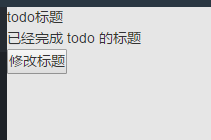

---
title: 初识Mobx
date: 2017-06-29 11:05:59
tags: mobx
categories: flux
--- 
Mobx是一个在redux之后出来的状态管理库，它比redux更清楚而且更易上手，因为redux在我看来繁杂，难受,而mobx简直是短小精悍啊！！！

## 那mobx的思想是什么呢？

他只做一件事： Action ===> State ===> Views

这篇文章主要是mobx起步的代码实现

## 安装依赖和配置.babelrc

```
npm install mobx --save
npm install mobx-react --save
npm install babel-core --save-dev
npm install babel-plugin-transform-decorators-legacy --save-dev

//babel-plugin-transform-decorators-legacy 是一个用来识别ES2017的@符号的转码器
```

然后，设置配置文件.babelrc。
```
{
  "plugins": ["transform-decorators"]
}
```
这时，Babel就可以对Decorator转码了,想要了解更多请戳这里[*修饰器*](http://es6.ruanyifeng.com/?search=%40&x=0&y=0#docs/decorator)

好到这里就已经装配好了mobx所需要的环境

## 编写简单demo

1. 首先我们需要一个Store来进行状态的保存
    ```
    class Store {
    @observable todos = [{
        title: "点击按钮即将修改的todo标题",
        done: true,
    },{
        title: "todo 的标题",
        done: true,
    },{
        title: "隐藏的 todo 的标题",
        done: false,
    }];

    @action changeTodoTitle({index,title}){
        this.todos[index].title = title
    }

    @computed get unfinishedTodos () {
        return  this.todos.filter((todo) => todo.done)
        //筛选todos中done为true的条目
    }
    }
    ```
    Store 中 todos 是一个被 @observable 可以观察类的值

    @action 修饰的方法就是 view 可以触发改变 store 值来重新渲染的途径

    @computed observable 的值初始化或改变时，自动运行,使用来计算的或者处理数据

    > 官方是这么解释的：
    > 计算值函数是通过当前状态或者其他计算值衍生出来的。理论上，它们和Excel中的公式非常类似。 请重视计算值，它们会帮助你减少需要修改的状态。因为它是经过高度优化的，所以请尽可能地使用他们。

    当然还有Autorun, 如果你想使用一个自动运行函数，且并不想产生一个新值时，使用 autorun,这个例子暂时没用到

2. 给出一个需要被观察的组件

    ```
    @observer
    class TodoBox extends Component {

    render() {
        console.log('component is updating');
        return (
        <div>
            <ul>
            {this.props.store.unfinishedTodos.map(
                (todo,index) => <li key={index}>{todo.title}</li>
            )}
            </ul>
            <div>
            <input type="button" onClick={() => {
                this.props.store.changeTodoTitle({index:0,title:"修改后的todo标题"});
            }} value="修改标题"/>
            </div>
        </div>
        )
    }
    }
    ```

    this.props.store是下一步要加上的，其他的一看就懂，没有什么特别要说的

3. 将组件挂载到dom上

    一般项目都是SPA然后通过前端路由给直接挂载到根节点上

    ```
    const store = new Store();
    //这个Store是上面第一步用 class 创建的类

    export default class MobxTest extends Component {

    render () {
        return (
        <TodoBox store={store} />
        )
    }
    }
    ```

    这个demo视图层分为两部分

    

    一个是渲染的list，一个是触发按钮,当我们点击按钮后，传入的{index:0,title:"修改后的tode标题"}会进入@action方法中，然后对@observable todo的相应记录进行修改，其结果再返回给组件本身。

    

    **如果是修改todo的第三个对象，也就是title为“隐藏的 todo 的标题”，TodoBox不会刷新，因为在unfinishedTodos函数中已经过滤了那个对象，所以他只是在Store中被改变了，而数据并没有传给TodoBox组件**

    这也算是很符合flux思想的库了，用起来写法非常简洁，但由于是新框架，所以还是有很多坑未被发现，如果想要在实际项目中使用的话，具体API可以戳[**这里**](https://suprise.gitbooks.io/mobx-cn/content/)

## 辅助函数

在实际开发中，需要用到不少 mobx 的辅助函数，这些辅助函数一共 14 个，挑了一些列举如下。

autorun
observable 的值初始化或改变时，自动运行。

trasaction
批量改变时，通过 trasaction 包装，只会触发一次 autorun。

extendsObservable
对类的属性或实例，进行监听。

observable
对普通对象进行监听。

map
使用 asMap 将对象转化为 map。

action-strict
在 mobx.usrStrict(true)时，只能通过 action 触发值的改变。

when
类似 autorun.

mobx.when 第一个参数是一个函数，初始化时也会自动执行。该函数返回一个 boolean 值，当返回值为 true 的时候，才会继续触发第一个函数。当返回值为 flase 时，不再继续监听。这时会执行 mobx.when 的第二个参数，这个参数也是一个函数。

reaction
类似 autorun.

reaction 不会在初始化时执行，只会在值改变的时候执行。

该函数有 2 个值，第一个参数是一个函数，返回监听的值.第二个参数，也是一个函数，会在值改变的时候执行。

spy
类似 aoturun.

监听所有 mobx 的事件。

包含一个 type ，该值用来区分执行事件的类型。

whyRun
用于调试，打印 autorun 为什么会触发。

-------------------------------------
## 华丽分割，日常结尾

短小精悍的mobx有没有让你心动呢~~~

