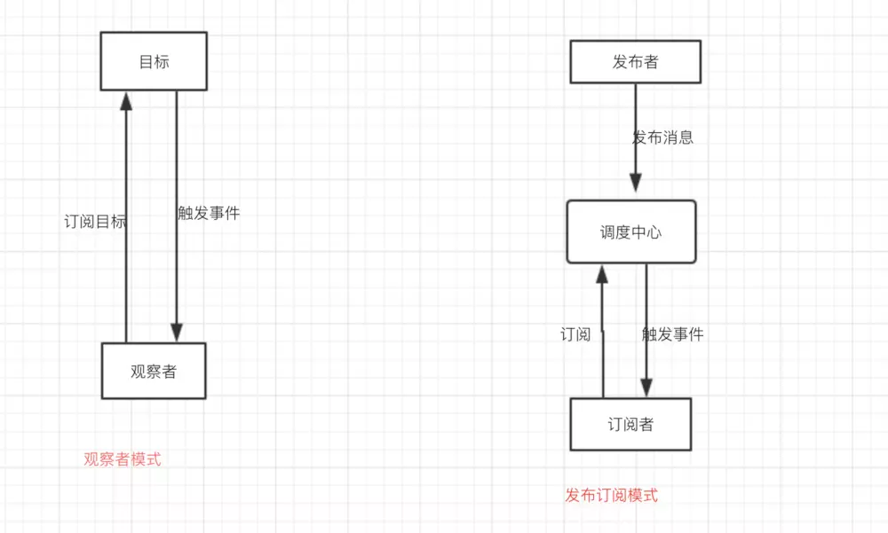

观察者模式和发布订阅模式最大的区别就是发布订阅模式有个事件调度中心。

## react项目目录框架



观察者模式是在目标（被观察者）内部进行change然后分别调用观察者注入不同的API；

发布订阅者模式则是将change事件和dispatcher分开，使之完全解耦；

观察者模式：

```bash
// 观察者
class Observer {
    constructor() {

    }
    update(val) {

    }
}
// 观察者列表
class ObserverList {
    constructor() {
        this.observerList = []
    }
    add(observer) {
        return this.observerList.push(observer);
    }
    remove(observer) {
        this.observerList = this.observerList.filter(ob => ob !== observer);
    }
    count() {
        return this.observerList.length;
    }
    get(index) {
        return this.observerList[index];
    }
}
// 目标
class Subject {
    constructor() {
        this.observers = new ObserverList();
    }
    addObserver(observer) {
        this.observers.add(observer);
    }
    removeObserver(observer) {
        this.observers.remove(observer);
    }
    notify(...args) {
        let obCount = this.observers.count();
        for (let index = 0; index < obCount; index++) {
            this.observers.get(i).update(...args);
        }
    }
}
```

发布订阅模式：
```bash
class PubSub {
    constructor() {
        this.subscribers = {}
    }
    subscribe(type, fn) {
        if (!Object.prototype.hasOwnProperty.call(this.subscribers, type)) {
          this.subscribers[type] = [];
        }
        
        this.subscribers[type].push(fn);
    }
    unsubscribe(type, fn) {
        let listeners = this.subscribers[type];
        if (!listeners || !listeners.length) return;
        this.subscribers[type] = listeners.filter(v => v !== fn);
    }
    publish(type, ...args) {
        let listeners = this.subscribers[type];
        if (!listeners || !listeners.length) return;
        listeners.forEach(fn => fn(...args));        
    }
}

let ob = new PubSub();
ob.subscribe('add', (val) => console.log(val));
ob.publish('add', 1);
```

观察者模式跟我们平时用的事件也有一定的关系，比如：

```bash
ele.addEventListener('click', () => {});
```

addEventListener就相当于注册了一个观察者，当观察到‘click’事件的时候，作出一些处理。
