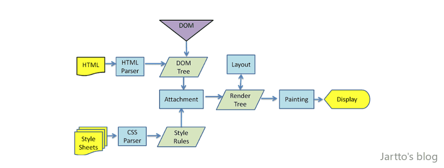
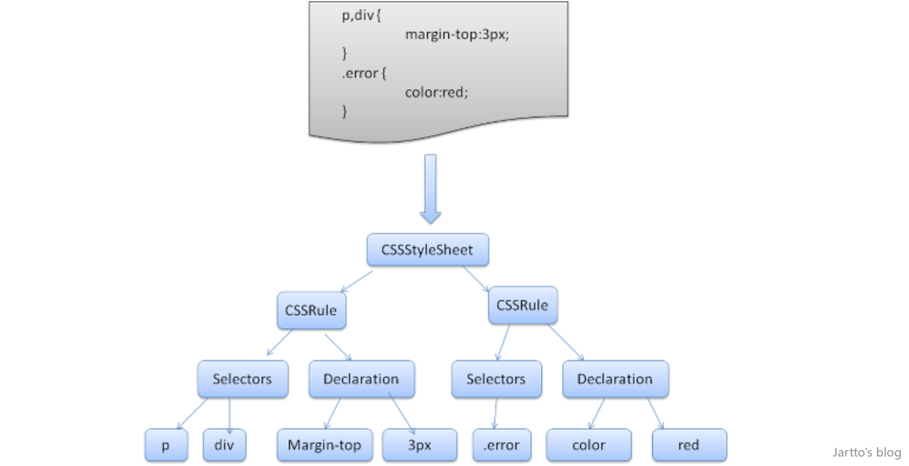
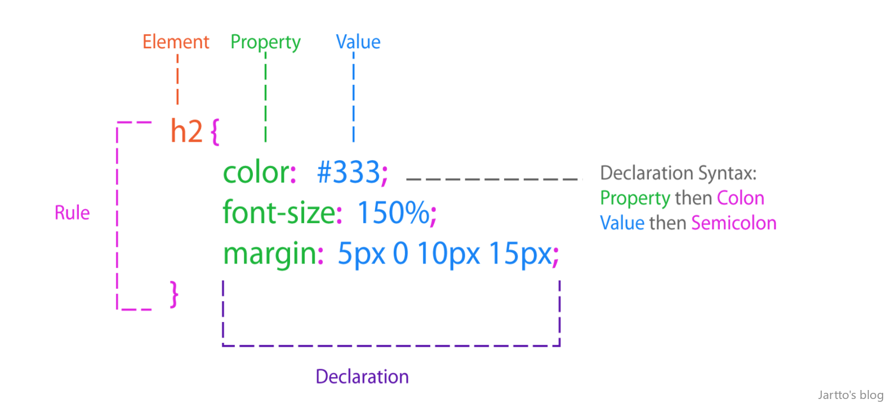
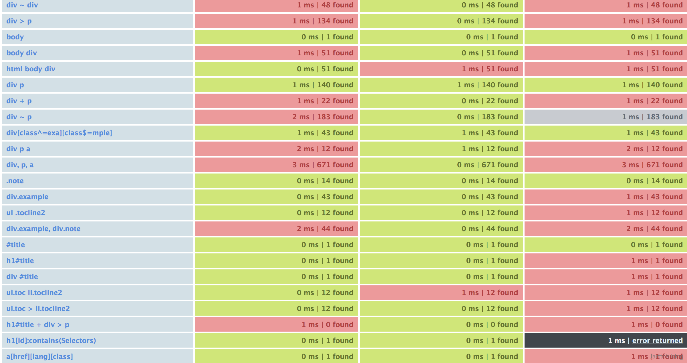

吃早饭的时候，同事随意问了一句：“你知道 CSS 是怎么解析的吗？”，我一头雾水。对哦，作为前端，每天都在与 CSS 打交道，我竟然忽视了最基本的原理。

## 一、浏览器渲染

开篇，我们还是不厌其烦的回顾一下浏览器的渲染过程，先上图：



正如上图所展示的，我们浏览器渲染过程分为了两条主线：

其一，HTML Parser 生成的 DOM 树；

其二，CSS Parser 生成的 Style Rules ；

在这之后，DOM 树与 Style Rules 会生成一个新的对象，也就是我们常说的 Render Tree 渲染树，结合 Layout 绘制在屏幕上，从而展现出来。

> 本文的重点也就集中在第二条分支上，我们来探究一下 CSS 解析原理。

## 二、Webkit CSS 解析器

浏览器 CSS 模块负责 CSS 脚本解析，并为每个 Element 计算出样式。CSS 模块虽小，但是计算量大，设计不好往往成为浏览器性能的瓶颈。

CSS 模块在实现上有几个特点：CSS 对象众多(颗粒小而多)，计算频繁(为每个 Element 计算样式)。这些特性决定了 webkit 在实现 CSS 引擎上采取的设计，算法。如何高效的计算样式是浏览器内核的重点也是难点。

先来看一张图：



> Webkit 使用 Flex 和 Bison 解析生成器从 CSS 语法文件中自动生成解析器。

它们都是将每个 CSS 文件解析为样式表对象，每个对象包含 CSS 规则，CSS 规则对象包含选择器和声明对象，以及其他一些符合 CSS 语法的对象，下图可能会比较明了：



Webkit 使用了自动代码生成工具生成了相应的代码，也就是说词法分析和语法分析这部分代码是自动生成的，而 Webkit 中实现的 CallBack 函数就是在 CSSParser 中。

CSS 的一些解析功能的入口也在此处，它们会调用 lex , parse 等生成代码。相对的，生成代码中需要的 CallBack 也需要在这里实现。

举例来说，现在我们来看其中一个回调函数的实现，createStyleRule(),该函数将在一般性的规则需要被建立的时候调用，代码如下：

```
CSSRule* CSSParser::createStyleRule(CSSSelector* selector)  
{  
    CSSStyleRule* rule = 0;  
    if (selector) {  
        rule = new CSSStyleRule(styleElement);  
        m_parsedStyleObjects.append(rule);  
        rule->setSelector(sinkFloatingSelector(selector));  
        rule->setDeclaration(new CSSMutableStyleDeclaration(rule, parsedProperties, numParsedProperties));  
    }  
    clearProperties();  
    return rule;  
}
```

从该函数的实现可以很清楚的看到，解析器达到某条件需要创建一个 CSSStyleRule 的时候将调用该函数，该函数的功能是创建一个 CSSStyleRule ，并将其添加已解析的样式对象列表 

<font color="#cccccc">m_parsedStyleObjects</font> 中去，这里的对象就是指的 Rule 。

那么如此一来，经过这样一番解析后，作为输入的样式表中的所有 Style Rule 将被转化为 Webkit 的内部模型对象 CSSStyleRule 对象，存储在 m_parsedStyleObjects 中，它是一个 Vector。

> 但是我们解析所要的结果是什么？

1.通过调用 CSSStyleSheet 的 parseString 函数，将上述 CSS 解析过程启动，解析完一遍后，把 Rule 都存储在对应的 CSSStyleSheet 对象中；

2.由于目前规则依然是不易于处理的，还需要将之转换成 CSSRuleSet。也就是将所有的纯样式规则存储在对应的集合当中，这种集合的抽象就是 CSSRuleSet；

3.CSSRuleSet 提供了一个 addRulesFromSheet 方法，能将 CSSStyleSheet 中的 rule 转换为 CSSRuleSet 中的 rule ；

4.基于这些个 CSSRuleSet 来决定每个页面中的元素的样式；

## 三、CSS 选择器解析顺序

可能很多同学都知道排版引擎解析 CSS 选择器时是从右往左解析，这是为什么呢？

1.HTML 经过解析生成 DOM Tree（这个我们比较熟悉）；而在 CSS 解析完毕后，需要将解析的结果与 DOM Tree 的内容一起进行分析建立一棵 Render Tree，最终用来进行绘图。Render Tree 中的元素（WebKit 中称为「renderers」，Firefox 下为「frames」）与 DOM 元素相对应，但非一一对应：一个 DOM 元素可能会对应多个 renderer，如文本折行后，不同的「行」会成为 render tree 种不同的 renderer。也有的 DOM 元素被 Render Tree 完全无视，比如 display:none 的元素。

2.在建立 Render Tree 时（WebKit 中的「Attachment」过程），浏览器就要为每个 DOM Tree 中的元素根据 CSS 的解析结果（Style Rules）来确定生成怎样的 renderer。对于每个 DOM 元素，必须在所有 Style Rules 中找到符合的 selector 并将对应的规则进行合并。选择器的「解析」实际是在这里执行的，在遍历 DOM Tree 时，从 Style Rules 中去寻找对应的 selector。

3.因为所有样式规则可能数量很大，而且绝大多数不会匹配到当前的 DOM 元素（因为数量很大所以一般会建立规则索引树），所以有一个快速的方法来判断「这个 selector 不匹配当前元素」就是极其重要的。

4.如果正向解析，例如「div div p em」，我们首先就要检查当前元素到 html 的整条路径，找到最上层的 div，再往下找，如果遇到不匹配就必须回到最上层那个 div，往下再去匹配选择器中的第一个 div，回溯若干次才能确定匹配与否，效率很低。

对于上述描述，我们先有个大概的认知。接下来我们来看这样一个例子：

```
<div>
   <div class="jartto">
      <p><span> 111 </span></p>
      <p><span> 222 </span></p>
      <p><span> 333 </span></p>
      <p><span class='yellow'> 444 </span></p>
   </div>
</div>
```

CSS 选择器：
```
div > div.jartto p span.yellow{
   color:yellow;
}
```

对于上述例子，如果按从左到右的方式进行查找：

1.先找到所有 div 节点；

2.在 div 节点内找到所有的子 div ,并且是 class = “jartto”；

3.然后再依次匹配 p span.yellow 等情况；

4.遇到不匹配的情况，就必须回溯到一开始搜索的 div 或者 p 节点，然后去搜索下个节点，重复这样的过程。

> 这样的搜索过程对于一个只是匹配很少节点的选择器来说，效率是极低的，因为我们花费了大量的时间在回溯匹配不符合规则的节点。

如果换个思路，我们一开始过滤出跟目标节点最符合的集合出来，再在这个集合进行搜索，大大降低了搜索空间。来看看从右到左来解析选择器：

1.首先就查找到 的元素；

2.紧接着我们判断这些节点中的前兄弟节点是否符合 P 这个规则，这样就又减少了集合的元素，只有符合当前的子规则才会匹配再上一条子规则。

> 结果显而易见了，众所周知，在 DOM 树中一个元素可能有若干子元素，如果每一个都去判断一下显然性能太差。而一个子元素只有一个父元素，所以找起来非常方便。

试想一下，如果采用从左至右的方式读取 CSS 规则，那么大多数规则读到最后（最右）才会发现是不匹配的，这样会做费时耗能，最后有很多都是无用的；而如果采取从右向左的方式，那么只要发现最右边选择器不匹配，就可以直接舍弃了，避免了许多无效匹配。

> 浏览器 CSS 匹配核心算法的规则是以从右向左方式匹配节点的。这样做是为了减少无效匹配次数，从而匹配快、性能更优。

## 四、CSS 语法解析过程

CSS 样式表解析过程中讲解的很细致，这里我们只看 CSS 语法解释器，大致过程如下：

1.先创建 CSSStyleSheet 对象。将 CSSStyleSheet 对象的指针存储到 CSSParser 对象中。

2.CSSParser 识别出一个 simple-selector ，形如 “div” 或者 “.class”。创建一个 CSSParserSelector 对象。

3.CSSParser 识别出一个关系符和另一个 simple-selecotr ，那么修改之前创建的 simple-selecotr, 创建组合关系符。

4.循环第3步直至碰到逗号或者左大括号。

5.如果碰到逗号，那么取出 CSSParser 的 reuse vector，然后将堆栈尾部的 CSSParserSelector 对象弹出存入 Vecotr 中，最后跳转至第2步。如果碰到左大括号，那么跳转至第6步。

6.识别属性名称，将属性名称的 hash 值压入解释器堆栈。

7.识别属性值，创建 CSSParserValue 对象，并将 CSSParserValue 对象存入解释器堆栈。

8.将属性名称和属性值弹出栈，创建 CSSProperty 对象。并将 CSSProperty 对象存入 CSSParser 成员变量m_parsedProperties 中。

9.如果识别处属性名称，那么转至第6步。如果识别右大括号，那么转至第10步。

10.将 reuse vector 从堆栈中弹出，并创建 CSSStyleRule 对象。CSSStyleRule 对象的选择符就是 reuse vector, 样式值就是 CSSParser 的成员变量 m_parsedProperties 。

11.把 CSSStyleRule 添加到 CSSStyleSheet 中。

12.清空 CSSParser 内部缓存结果。

13.如果没有内容了，那么结束。否则跳转值第2步。


五、内联样式如何解析？
通过上文的了解，我们知道，当 CSS Parser 解析完 CSS 脚本后，会生成 CSSStyleSheetList ，他保存在Document 对象上。为了更快的计算样式，必须对这些 CSSStyleSheetList 进行重新组织。

计算样式就是从 CSSStyleSheetList 中找出所有匹配相应元素的 property-value 对。匹配会通过CSSSelector 来验证，同时需要满足层叠规则。

将所有的 declaration 中的 property 组织成一个大的数组。数组中的每一项纪录了这个 property 的selector，property 的值，权重（层叠规则）。

可能类似如下的表现：

```
p > a { 
  color : red; 
  background-color:black;
}  
a {
  color : yellow
}  
div { 
  margin : 1px;
}
```

重新组织之后的数组数据为(weight我只是表示了他们之间的相对大小，并非实际值。
```
   selector      property                       weight  
1, a             color:yellow                   1  
2, p > a         color:red                      2  
3, p > a         background-color:black         2  
4, div           margin:1px                     3
```

好了，到这里，我们来解决上述问题：

首先，要明确，内敛样式只是 CSS 三种加载方式之一；

其次，浏览器解析分为两个分支，HTML Parser 和 CSS Parser，两个 Parser 各司其职，各尽其责；

最后，不同的 CSS 加载方式产生的 Style rule ，通过权重来确定谁覆盖谁；

> 到这里就不难理解了，对浏览器来说，內联样式与其他的加载样式方式唯一的区别就是权重不同。

深入了解，请阅读Webkit CSS引擎分析


## 六、何谓 computedStyle ？

到这里，你以为完了？Too young too simple, sometimes naive!

浏览器还有一个非常棒的策略，在特定情况下，浏览器会共享 computedStyle，网页中能共享的标签非常多，所以能极大的提升执行效率！如果能共享，那就不需要执行匹配算法了，执行效率自然非常高。

也就是说：如果两个或多个 element 的 computedStyle 不通过计算可以确认他们相等，那么这些 computedStyle 相等的 elements 只会计算一次样式，其余的仅仅共享该 computedStyle 。

那么有哪些规则会共享 computedStyle 呢？

- 该共享的element不能有id属性且CSS中还有该id的StyleRule.哪怕该StyleRule与Element不匹配。

- tagName和class属性必须一样;

- mappedAttribute必须相等;

- 不能使用sibling selector，譬如:first-child, :last-selector, + selector;

- 不能有style属性。哪怕style属性相等，他们也不共享;

```
<span><p style="color:red">paragraph1</span></p>
<span><p style="color:red">paragraph2</span></p>
```

当然，知道了共享 computedStyle 的规则，那么反面我们也就了解了：不会共享 computedStyle 的规则，这里就不展开讨论了。

深入了解，请参考：Webkit CSS 引擎分析 - 高效执行的 CSS 脚本

## 七、眼见为实

如上图，我们可以看到不同的 CSS 选择器的组合，解析速度也会受到不同的影响，你还会轻视 CSS 解析原理吗？



如上图，我们可以看到不同的 CSS 选择器的组合，解析速度也会受到不同的影响，你还会轻视 CSS 解析原理吗？

感兴趣的同学可以参考这里：[speed/validity selectors test for frameworks](http://test.veryos.com/selector/slickspeed/index.html)


## 八、有何收获？

1.使用 id selector 非常的高效。在使用 id selector 的时候需要注意一点：因为 id 是唯一的，所以不需要既指定 id 又指定 tagName：

``` 
Bad
p#id1 {color:red;}  
Good  
#id1 {color:red;}
```

> 当然，你非要这么写也没有什么问题，但这会增加 CSS 编译与解析时间，实在是不值当。

2.避免深层次的 node ，譬如：

```
Bad  
div > div > div > p {color:red;} 
Good  
p-class{color:red;}
```

3.慎用 ChildSelector ；

4.不到万不得已，不要使用 attribute selector，如：p[att1=”val1”]。这样的匹配非常慢。更不要这样写：p[id=”id1”]。这样将 id selector 退化成 attribute selector。
```
Bad  
p[id="id1"]{color:red;}  
p[class="class1"]{color:red;}  
Good 
#id1{color:red;}  
.class1{color:red;}
```

5.理解依赖继承，如果某些属性可以继承，那么自然没有必要在写一遍；

6.规范真的很重要，不仅仅是可读性，也许会影响你的页面性能。这里推荐一个 [CSS 规范](http://nec.netease.com/standard/css-sort.html)，可以参考一下。

> 转载于[<font color="#ffaadd">Jartto's blog</font>](http://jartto.wang/2017/11/13/Exploring-the-principle-of-CSS-parsing/index.html?nsukey=iXHASULuDIGzymkvvYdxZWQ%2BVlVSsYwJmUU6Cv85KBz%2FYR7aGaoDZvsQpydtjSdOZ5mdF7EwDcf9YqD5gQFOGGqOg3duDLm54JQ1K8pWPS2HvP0rpK7nv04MWuzLV3tSna%2F1Jq57MFb7l3htdVs%2B8aHjit84gvcLnORjcnqF7kvXECphINJlv5EVGxBz5LWX)


