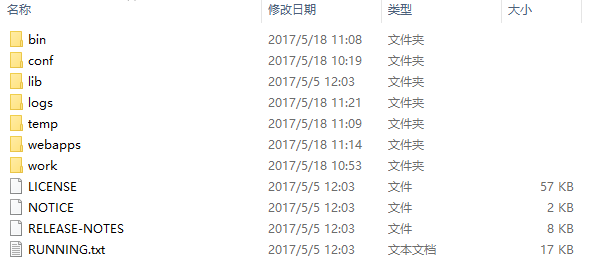
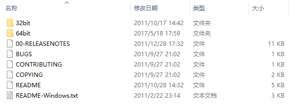
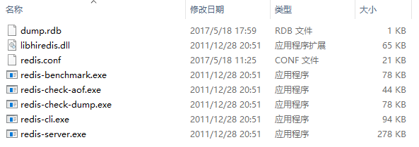
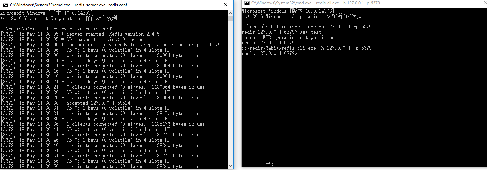
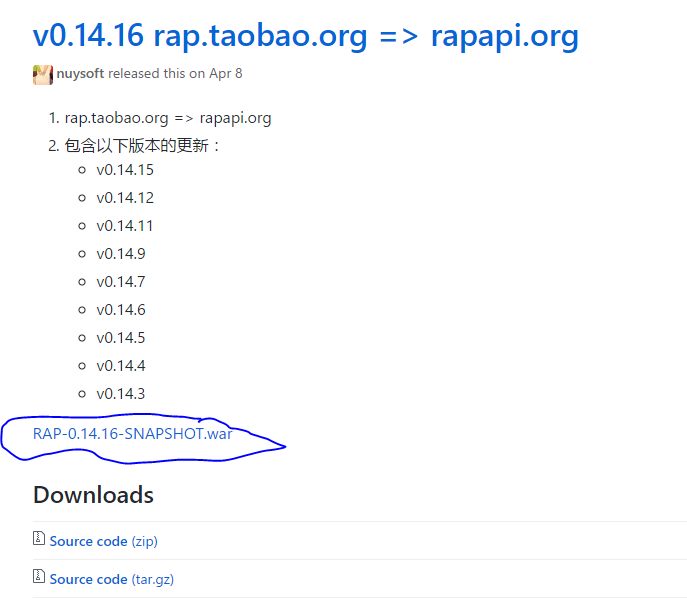
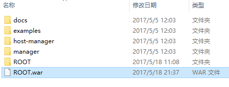
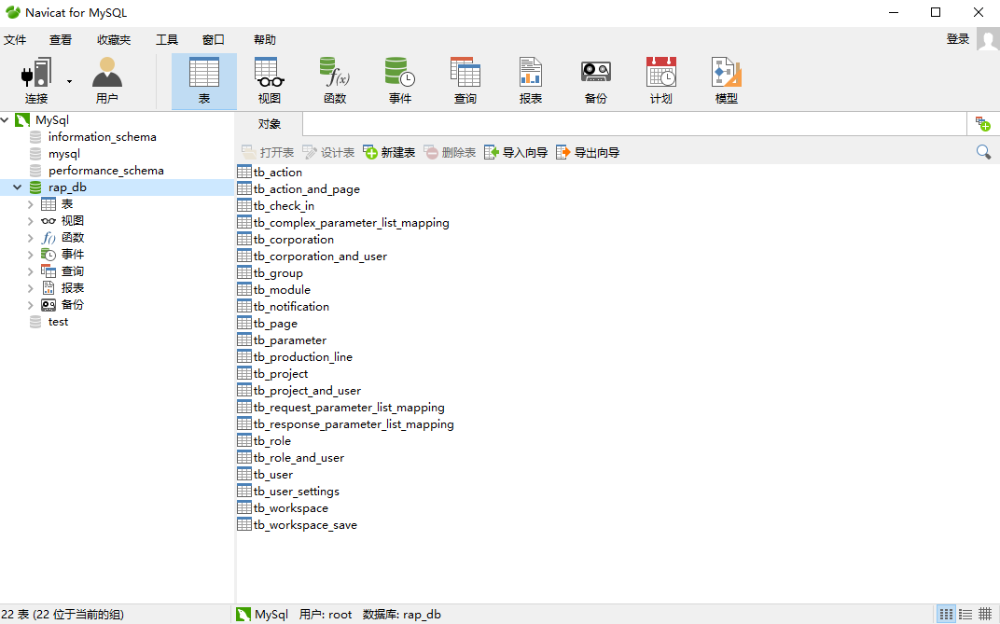

对于前后端分离之后，前端进行页面渲染的话，数据何来？

当然有很多种方法：

- node.js来模拟接口
- json-server来进行模拟接口

    …………

但是，其直观性和管理维护不太方便，打开文件，看到的全是代码。

所以今天来教教大家如何搭建一个可视化的mock数据平台

## 重要内容

安装前的准备：

-  [MySql](https://www.mysql.com/downloads/)
-  [JDK](http://www.oracle.com/technetwork/java/javase/downloads/jdk8-downloads-2133151.html)
-  [tomcat](http://tomcat.apache.org/download-80.cgi)
-  [redis](https://redis.io/download)
-  [RAP包](https://github.com/thx/RAP/releases)
-  [navicat(*可选*)](http://rj.baidu.com/soft/detail/24312.html?ald)

全部下载好这些我们就开始准备配置自己的mock数据平台了

*本文用的时 **windows** 系统，**建议大家把这个装到 linux 上***

1. 这里JDK基本安装就不重复介绍了

2. MySql安装，基本都是一路next下去，没什么好说的

    不会的同学，请出门右拐“[*<font color="red">百度一下</font>*](https://www.baidu.com)”

    > 偷偷告诉大家，JDK也可以偷偷懒，用[*Chocolatey*](https://chocolatey.org/)进行自动安装配置
    >
    > 要安装Chocolatey很容易，必须**以管理员权限打开cmd.exe命令行提示**，执行如下内容：
    >

    ```
    @powershell -NoProfile -ExecutionPolicy Bypass -Command "iex ((new-object net.webclient).DownloadString('https://chocolatey.org/install.ps1'))" && SET PATH=%PATH%;%ALLUSERSPROFILE%\chocolatey\bin
    ```
    然后在输入安装命令，进行JDK8的自动安装：
    ```
    choco install jdk8
    ```
3. tomcat把他解压安装到自己喜欢的一个目录下，目录结构应该是这样的：

    

    这里说几个稍微要知道的文件夹

    - bin : tomcat启动文件目录，到时候服务器搭建起来的时候会让大家进入
    - logs: 文件日志目录，如果在tomcat运行过程中有任何错误都会记录在这个目录下
    - webapp: 这个是我们最后要把RAP的war包放进去的<font color="red">**主要根目录**</font>

    OK,了解这些现在继续下一步

4. redis安装：

    redis安装说简单也复杂，但是一定要仔细了

      将下载的 redis-2.4.5-win32-win64.zip 包解压到自己喜爱的一个目录下
      
      

      这是redis的根目录文件，选择与自己机器相对应的（32或34位）

      

      **<font color="red">注意：</font>** 这里有个坑的地方就是 redis一定要设置密码！！
      
      打开上面的redis.conf文件，在里面找到 *requirepass* ，将其设置为 

      > requirepass <your_password>

      然后在该目录下运行cmd

      ```
      redis-server.exe redis.conf
      ```
      ```
      redis-cli.exe -h 127.0.0.1 -p 6379
      ```
      

      出现了这样的界面，说明你的redis安装成功了~！
        
4. RAP包下载
    
    
    下载这个WAR包，然后修改里面的*src\main\resources\config.properties*

    ```
    jdbc.driverClassName=com.mysql.jdbc.Driver
    jdbc.url=jdbc\:mysql\://localhost\:3306/rap_db?useUnicode\=true&characterEncoding\=utf8&zeroDateTimeBehavior\=convertToNull&noAccessToProcedureBodies\=true
    jdbc.username=root
    jdbc.password= <your_mySql_password>
    redis.host=localhost
    redis.port=6379
    redis.timeout=2000
    redis.password= <your_redis_password>
    redis.database=0
    ```
    修改其中的 *your_mySql_password* 和 *your_redis_password* 为你自己设置的密码

    然后把这个WAR包改名为ROOT.war，丢到tomcat的webapp的目录下（与ROOT文件同级）

    

5. mySql建表

    在rap的war包中 *src\main\resources\database* 有initalize.sql

    这是数据库建表的sql语句，所以可以打开我们的mySql的可视化工具Navicat，运行此sql文件，然后刷新一下

    

    就可以看到这些表了

## 深吸一口气

万事俱备，让我们来一起见证我们的RAP平台吧

要看到RAP平台，一共要打开三个服务。（前两个就是我们启用redis时的那两）

进入redis的64bit文件，运行如下两句话（*一定要按顺序！*）

```
redis-server.exe redis.conf
```

```
redis-cli.exe -h 127.0.0.1 -p 6379
```

再而进入到tomcat的安装目录下/bin文件中，双击startup.bat批处文件

若不报错，这就成功的完成了RAP服务的搭建了~

打开浏览器，访问 localhost:8080

感叹一声： <font color="red">**完美！** </font>


